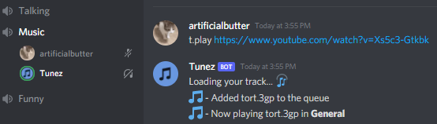

# Tunez has reached end of life, and this repository is now archived.
## Check out [NerdyTechy/Melody](https://github.com/NerdyTechy/Melody) for a better & maintained music bot.

<!-- PROJECT LOGO -->
 

  

  <h3 align="center">Tunez</h3>

  

    Tunez has a website! Visit it at <a href="https://tunez.ml">tunez.ml</a>
     
    <a href="https://tunez.ml/invite2"><strong>Invite the bot! »</strong></a>
     
    <a href="https://github.com/artificialbutter/TunezV2/issues">Report Bug</a>
  

<!-- TABLE OF CONTENTS -->

  
Table of Contents

  <ol>
    <li>
      <a href="#about-the-project">About The Project</a>
      <ul>
        <li><a href="#built-with">Built With</a></li>
      </ul>
    </li>
    <li><a href="#usage">Usage</a></li>
    <li><a href="#roadmap">Roadmap</a></li>
    <li><a href="#contributing">Contributing</a></li>
    <li><a href="#license">License</a></li>
    <li><a href="#acknowledgments">Acknowledgments</a></li>
  </ol>

<!-- ABOUT THE PROJECT -->
## About

A bot originally created around March 2021 for my personal server as just another music bot. It has since been rewritten and improved upon, and was brought online again to try and fill in the gap groovy left. 

(<a href="#top">back to top</a>)

### Built With

* [discord.js](https://discord.js.org/)
* [Discord Player](https://www.npmjs.com/package/discord-player)
* [/Create](https://www.npmjs.com/package/slash-create)

<!-- USAGE EXAMPLES -->
## Usage
#### All of the commands are accessed using discord's slash commands, which can be accessed by typing / in discord.
See Discord's <a href="https://support.discord.com/hc/en-us/articles/1500000368501-Slash-Commands-FAQ">Slash Command FAQ</a> for more info

### Commands

You can view all the commands in <a href="/Commands.md">Commands.md</a> or using Discord's built in slash command viewer

(<a href="#top">back to top</a>)

<!-- ROADMAP -->
## Roadmap

- [ ] Add instructions for self hosting
- [ ] Easy .exe to quickly host the bot
- [X] Add Command Documentation
- [X] Add slash commands
- [X] Rewrite

<!-- CONTRIBUTING -->
## Contributing

Contributions are what make the open source community such an amazing place to learn, inspire, and create. Any contributions you make are **greatly appreciated**.

If you have a suggestion that would make this better, please fork the repo and create a pull request. You can also simply open an issue with the tag "enhancement".

(<a href="#top">back to top</a>)

<!-- LICENSE -->
## License

Distributed under the GNU General Public License. See `LICENSE` for more information.

<!-- ACKNOWLEDGMENTS -->
## Acknowledgments

* [AndrozDev](https://github.com/Androz2091)

(<a href="#top">back to top</a>)

